Atomic Plugins for Construct 2
==================

These plugins can be used in Construct 2. They require a cordova exportation. 

## Configuration

### Ads

The plugin can be configured by selecting the object "ATPAds" from the "Object types" list inside Construct 2.

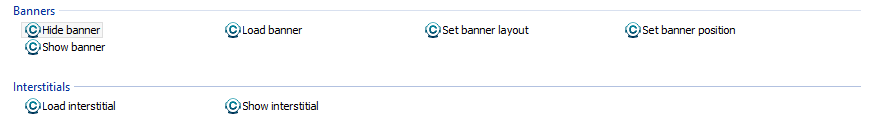
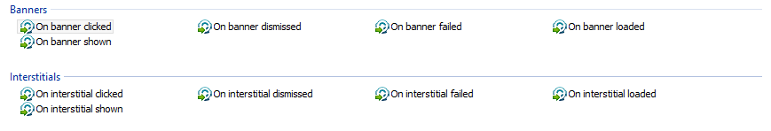
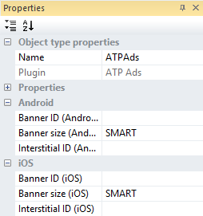

### InApps

The plugin is added by selecting the object "ATPInApps" from the "Object types" list inside Construct 2.


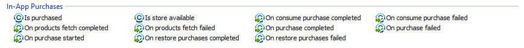
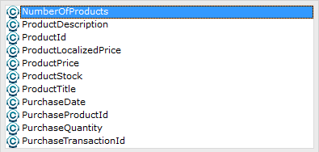

### Native Share

The plugin is added by selecting the object "ATPShare" from the "Object types" list inside Construct 2.

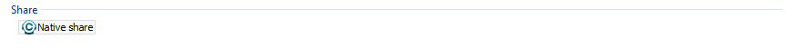
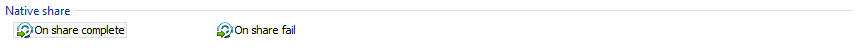

### Cocoon Canvas+

The plugin is added by selecting the object "CocoonCanvasplus" from the "Object types" list inside Construct 2.

This plugin will only work inside Canvas+ webview engine in Cocoon.io cloud compiler. 

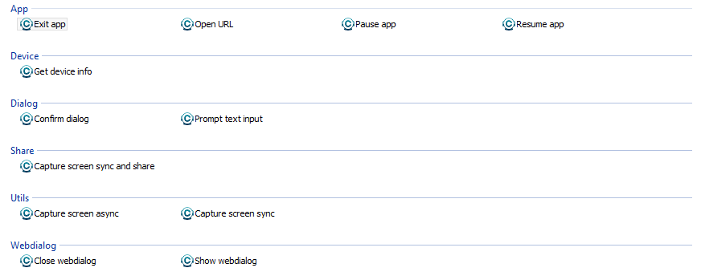
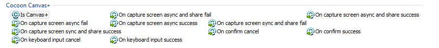
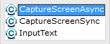

### Social integration 

This plugin is divided in three different parts, one of each social service available. 

#### Game Center

The plugin is added by selecting the object "ATPGameCenter" from the "Object types" list inside Construct 2.


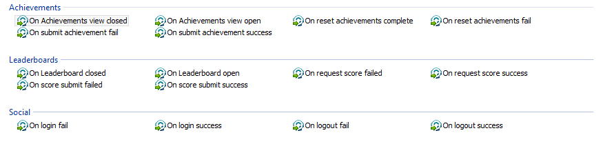
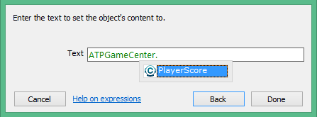

#### Google Play Games

The plugin is added by selecting the object "ATPGooglePlayGames" from the "Object types" list inside Construct 2.

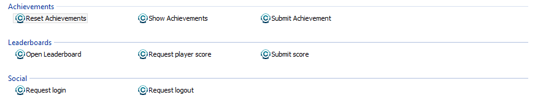

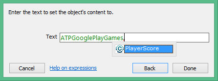

#### Facebook 

Work in progress

## Installation

### Manual installation

* **Close Construct 2**
* Checkout the 'master' branch from this repository. You will see several folders, one called "common" and one more for each of the available plugins. Currently there is only one for Ads. 
* Copy the folder which is inside the name of the plugin. They will always start by "atp". For example, inside "ads" there is one called "atp-ads". 
* Paste the whole folder into *_CONSTRUCT_2_INSTALLATION_FOLDER_*\exporters\html5\plugins.

And that's all! You can open Contruct2 to start using them! 

## Adding the plugins to a project after exportation 

### Ads 

After the cordova exportation and the creation of the project, one of the following plugins are needed, depending on the Ad Service you want to use. 

If you are using the CLI, copy and paste the command for installing the plugin in your project. 

If you are using the new Cocoon.io cloud compiler, select the plugin id from the plugin list in the project configuration and the plugin will be intalled automatically. 

#### Admob 

* Android
```
	cordova plugin add com.ludei.ads.android.admob;
```
* iOS
```
	cordova plugin add com.ludei.ads.ios.admob; 
```
#### Mopub
* Android
```
	cordova plugin add com.ludei.ads.android.mopub;
```
* iOS
```
	cordova plugin add com.ludei.ads.ios.mopub;
```
In addition, there are optional MoPub adapters for iOS and Android.

* Android
```
	cordova plugin add con.ludei.ads.android.adcolony;
	cordova plugin add con.ludei.ads.android.admob;
	cordova plugin add con.ludei.ads.android.charboost;
	cordova plugin add con.ludei.ads.android.greystripe;
	cordova plugin add con.ludei.ads.android.inmobi;
	cordova plugin add con.ludei.ads.android.millennial;
```
* iOS 
```
	cordova plugin add con.ludei.ads.android.adcolony; // new 
	cordova plugin add com.ludei.ads.ios.mopub.admob;
	cordova plugin add com.ludei.ads.ios.mopub.charboost;
	cordova plugin add com.ludei.ads.ios.mopub.millennial;
```

### In-App Purchases

After the cordova exportation and the creation of the project, one of the following plugins are needed, depending on the Store you want to use. 

If you are using the CLI, copy and paste the command for installing the plugin in your project. 

If you are using the new Cocoon.io cloud compiler, select the plugin id from the plugin list in the project configuration and the plugin will be intalled automatically. 

#### Google Play 
```
	cordova plugin add com.ludei.inapps.android.googleplay;
```
#### Amazon App Store 
```
	cordova plugin add con.ludei.inapps.android.amazon;
```
#### Apple App Store
```
	cordova plugin add com.ludei.inapps.ios.appstore;
```

### Native Share

After the cordova exportation and the creation of the project, it is required to install the following plugin for cordova. 

If you are using the CLI, copy and paste the command for installing the plugin in your project. 

If you are using the new Cocoon.io cloud compiler, select the plugin id from the plugin list in the project configuration and the plugin will be intalled automatically. 

```
	cordova plugin add com.ludei.share;
```
### Cocoon Canvas+

No additional plugins are required after exportation unless the sharing methods are used. If so, please, install the [Native share plugin](#native-share-2). 

### Social integration

After the cordova exportation and the creation of the project, one of the following plugins are needed, depending on the Social Service you want to use. 

If you are using the CLI, copy and paste the command for installing the plugin in your project. 

If you are using the new Cocoon.io cloud compiler, select the plugin id from the plugin list in the project configuration and the plugin will be intalled automatically. 

#### Game Center
```
	cordova plugin add com.ludei.social.ios.gamecenter;
```
#### Google Play Games
```
	cordova plugin add con.ludei.social.android.googleplaygames;
```
#### Facebook

Work in progress.

## Important information to take into account 

You can use these plugins in Cocoon.io cloud compiler or using the CLI. They won't work in the old compiler. 

## Need help?

Visit [our help center](https://support.ludei.com).

## Changelog

### Jun 24, 2015
* Atomic plugins for Social integration added (Game Center and Google Play Games).
* Webdialog, Device, App and Utils method added in Cocoon Canvas+ plugin. 

### Jun 22, 2015
* Atomic plugins for Native share added. 
* Cocoon Canvas+ legacies added (Keyboard, open URL, exit, confirm, capture screen,...). 

### May 28, 2015
* Common folder removed, no longer required. 

### May 25, 2015
* Repository moved to CocoonIO.
* Adcolony adapter for iOS added. 

### Apr 14, 2015
* Purchase events fixed for InApps.
* Demo for InApps added. 

### Mar 18, 2015
* Atomic Plugins for InApps added. 
* Supported Stores: Google Play, Amazon App Store and Apple App Store.

### Mar 11, 2015
* Demo for Ads added. 

### Mar 06, 2015
* Atomic Plugins for Ads added. 
* Supported Ad Services: Mopub and Admob. 

# License

Mozilla Public License, version 2.0

Copyright (c) 2015 Ludei 

See [`MPL 2.0 License`](LICENSE)


